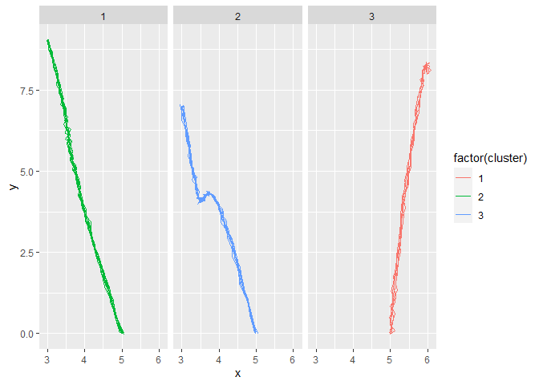
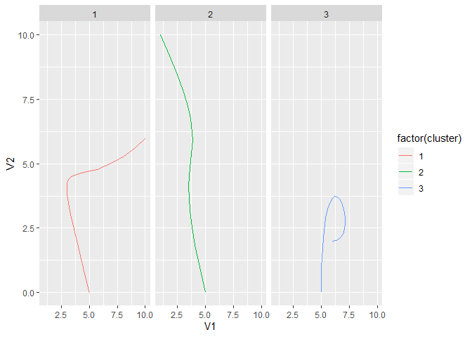

<!-- README.md is generated from README.Rmd. Please edit that file -->

# RouteIdentification

<!-- badges: start -->

<!-- badges: end -->

The goal of RouteIdentification is to
…

## Installation

<!--You can install the released version of RouteIdentification from [CRAN](https://CRAN.R-project.org) with:

``` r
install.packages("RouteIdentification")
```
 -->

And the development version from [GitHub](https://github.com/) with:

``` r
# install.packages("devtools")
devtools::install_github("danichusfu/RouteIdentification")
```

## Example

This is a basic example which shows you how to solve a common problem:

``` r
# devtools::install_github(repo = "danichusfu/RouteIdentification")

library(RouteIdentification)
#> Loading required package: ggplot2
#> Loading required package: purrr
#> Loading required package: tibble
#> Loading required package: dplyr
#> 
#> Attaching package: 'dplyr'
#> The following objects are masked from 'package:stats':
#> 
#>     filter, lag
#> The following objects are masked from 'package:base':
#> 
#>     intersect, setdiff, setequal, union
#> Loading required package: tidyr
#> Loading required package: stringr
#> Loading required package: readr
#> Loading required package: forcats
#> Loading required package: magrittr
#> 
#> Attaching package: 'magrittr'
#> The following object is masked from 'package:tidyr':
#> 
#>     extract
#> The following object is masked from 'package:purrr':
#> 
#>     set_names
#> Loading required package: tictoc
#> Loading required package: emdbook
#> Loading required package: bezier
#> Warning: replacing previous import 'tidyr::extract' by 'magrittr::extract' when
#> loading 'RouteIdentification'
#> Warning: replacing previous import 'purrr::set_names' by 'magrittr::set_names'
#> when loading 'RouteIdentification'

cluster_controls <- generate_random_cluster_controls(number_of_clusters = 3)

nested_trajectory_data <-
  generate_sample_data(cluster_controls, number_of_curves = 20) %>%
  select(curve_i, x, y, cluster = cluster_num)


em_results <-
  nested_trajectory_data %>%
  unnest(cols = c(x, y)) %>%
  cluster_trajectory_data(K = 3)
#> 0.01 sec elapsed
#> [1] 1
#> [1] "e_step time"
#> 0.49 sec elapsed
#> [1] -Inf
#> [1] "m_step time"
#> 0.03 sec elapsed
#> [1] 2
#> [1] "e_step time"
#> 0.5 sec elapsed
#> [1] 3493.878
#> [1] "m_step time"
#> 0.01 sec elapsed
#> [1] 3
#> [1] "e_step time"
#> 0.5 sec elapsed
#> 1.53 sec elapsed


cluster_means <-
  extract_cluster_means(em_results)

nested_trajectory_data %>%
  bind_cols(as_tibble(em_results$Pik)) %>%
  mutate(curve_i = row_number()) %>%
  pivot_longer(names_to = "pred_cluster", values_to = "prob", matches("\\d")) %>%
  mutate(pred_cluster = parse_number(pred_cluster)) %>%
  group_by(curve_i) %>%
  filter(prob == max(prob)) %>%
  ungroup() %>%
  count(cluster, pred_cluster)
#> # A tibble: 3 x 3
#>   cluster pred_cluster     n
#>     <dbl>        <dbl> <int>
#> 1       1            2     7
#> 2       2            3     5
#> 3       3            1     8

nested_trajectory_data %>%
  bind_cols(as_tibble(em_results$Pik)) %>%
  mutate(curve_i = row_number()) %>%
  pivot_longer(names_to = "pred_cluster", values_to = "prob", matches("\\d")) %>%
  mutate(pred_cluster = parse_number(pred_cluster)) %>%
  group_by(curve_i) %>%
  filter(prob == max(prob)) %>%
  unnest(cols = c(x, y)) %>%
ggplot(aes(x = x, y = y, group = curve_i, colour = factor(cluster))) +
  geom_path() +
  facet_wrap(~ pred_cluster)
```



``` r


ggplot(cluster_means, aes(x = V1, y = V2, colour = factor(cluster))) +
  geom_path()+
  facet_wrap(~ cluster)
```



``` r

new_nested_trajectory_data <-
  generate_sample_data(cluster_controls) %>%
  select(curve_i, x, y, cluster = cluster_num)


new_trajectory_data <- new_nested_trajectory_data %>% unnest(cols = c(x, y))

new_data_fit <- fit_new_data(new_trajectory_data, em_results)

new_data_fit %>%
  count(cluster, cluster_assigned)
#> # A tibble: 3 x 3
#>   cluster cluster_assigned     n
#>     <dbl>            <dbl> <int>
#> 1       1                2    37
#> 2       2                3    39
#> 3       3                1    44
```

``` r
nfl_em_results <- read_rds("data/em_results_30.rds")

# replace this with actual nfl route that has been transformed properly. Its incoming
fit_new_data(new_trajectory_data, nfl_em_results)
#> # A tibble: 120 x 4
#>    curve_i cluster           data cluster_assigned
#>      <int>   <dbl> <list<df[,2]>>            <dbl>
#>  1       1       2       [39 x 2]                3
#>  2       2       3       [37 x 2]               26
#>  3       3       1       [47 x 2]               24
#>  4       4       1       [43 x 2]               24
#>  5       5       1       [40 x 2]               24
#>  6       6       1       [45 x 2]               24
#>  7       7       3       [36 x 2]               26
#>  8       8       1       [38 x 2]               24
#>  9       9       1       [44 x 2]               24
#> 10      10       3       [43 x 2]               26
#> # ... with 110 more rows
```
